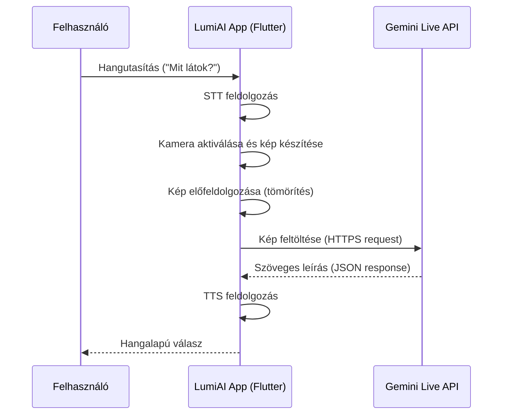
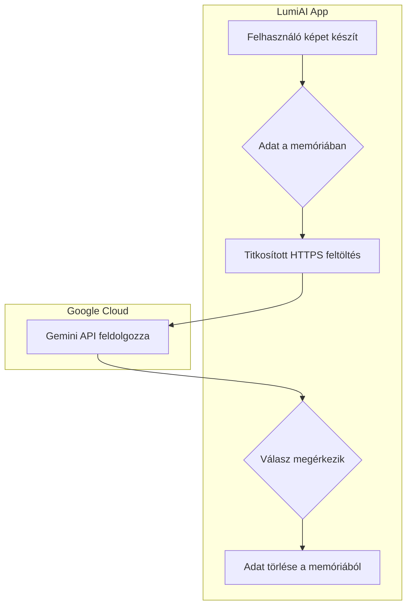

## *Funkcionális specifikáció –LumiAi*

---

### *1. rész – Rendszerarchitektúra, alapfunkciók és kommunikáció*

## 1.1. Rendszerarchitektúra

Az alkalmazás elsődlegesen **mobilplatformra** (Android és iOS) készül, mivel a célcsoport számára a hordozhatóság és a könnyű hozzáférhetőség alapvető szempont.  
A rendszer célja, hogy a felhasználó természetes módon, hangutasítások segítségével tudjon kapcsolatba lépni a környezetével.  
A rendszer architektúrája moduláris felépítésű, így a különböző komponensek önállóan fejleszthetők és karbantarthatók.

### Fő komponensek:

1. **Felhasználói modul (User Interface & Input/Output):**  
   - Felelős a felhasználóval való kommunikációért.  
   - A rendszer nem vizuális, hanem **hangalapú interfészt** használ.  
   - Tartalmazza a mikrofonvezérlést, a hangutasítások kezelését és a TTS alapú visszajelzést.  
   - A cél, hogy a látássérült felhasználó egyszerűen, vizuális megerősítés nélkül is kezelni tudja az alkalmazást.

2. **Képfeldolgozó modul (Image Processing Module):**  
   - A kamera által készített képeket előfeldolgozza.  
   - Feladata a képminőség optimalizálása (élesség, fényviszonyok javítása).  
   - Tömöríti és előkészíti az adatot a továbbításra a Gemini Live API felé.  
   - A feldolgozás során figyelni kell az adatbiztonságra és az adatméretre, hogy a kommunikáció hatékony maradjon.

3. **Kommunikációs modul (Network & API Handler):**  
   - Biztosítja az adatátvitelt az alkalmazás és a külső API-k között.  
   - Támogatja a **REST** és **WebSocket** alapú kommunikációt.  
   - Feladata az adatok titkosított (HTTPS) csatornán történő továbbítása.  
   - Hálózati hibák esetén automatikusan újrapróbálkozást végez vagy offline módba vált.

4. **Hangfeldolgozó modul (Speech Processing Module):**  
   - A beszéd felismerését (STT – Speech-to-Text) és a válaszok felolvasását (TTS – Text-to-Speech) végzi.  
   - Integrálható szolgáltatások: **Google Speech API**, **Whisper**, vagy az adott operációs rendszer beépített megoldása.  
   - Biztosítja a természetes hangzást, valamint a többnyelvű támogatást (pl. magyar és angol).

5. **Vezérlő logikai modul (Core Logic / Decision Engine):**  
   - Összefogja az összes modul működését.  
   - Elemzi a felhasználó kérését, eldönti, hogy milyen műveletet kell végrehajtani.  
   - Például: ha a felhasználó azt mondja, *„Mit látok?”*, akkor a kamera modult aktiválja, és elindítja a képfeldolgozást.  
   - A modul figyel a hibákra, eseményekre, és biztosítja a folyamatos működést.

 ## 1.2. Adatáramlás

Az adatáramlás a rendszer működésének alapja.  
A modulok közötti kommunikáció eseményvezérelt, így minden lépés meghatározott sorrendben történik.

### Folyamatleírás:

1. A felhasználó **hangparancsot** ad, például: „Mit látok magam előtt?”.  
2. A **mikrofon** rögzíti a hangot, és továbbítja az STT modulnak.  
3. Az **STT modul** felismeri és szöveggé alakítja a hangot.  
4. A **vezérlő logika** elemzi a szöveget, meghatározza a feladat típusát.  
5. A rendszer aktiválja a **kamera modult**, amely képet készít a környezetről.  
6. A kép előfeldolgozása megtörténik (méret, fény, kontraszt beállítás).  
7. A kép **base64 formátumban** vagy **multipart form-data** struktúrában elküldésre kerül a Gemini Live API-nak.  
8. A **Gemini Live API** mesterséges intelligenciája elemzi a képet és leírja annak tartalmát.  
9. Az API **szöveges választ** küld vissza a rendszernek, például: „Egy asztalt és egy laptopot látok.”  
10. A válasz szöveges formában megérkezik az alkalmazásba.  
11. A **TTS modul** hangos formába alakítja a választ.  
12. A felhasználó **hangos visszajelzést** kap: „Egy asztalt és egy laptopot látsz.”  

### További részletek:

- Az adatfolyam valós időben zajlik, a késleltetés minimalizálása érdekében.  
- Hibakezelés beépítve: ha a hálózat megszakad, a rendszer hangosan jelzi („A kapcsolat megszakadt.”).  
- Az adatok feldolgozása titkosított csatornán történik, így a személyes információk védelme biztosított.

## 1.3. Kommunikációs interfészek

A rendszer több különböző interfészen keresztül kommunikál, mind külső, mind belső szinten.

### 1.3.1. Gemini Live API
- A **Gemini Live API** egy felhőalapú szolgáltatás, amely képfelismerést és leírásgenerálást végez.  
- A kommunikáció **HTTPS** vagy **WebSocket** alapon zajlik.  
- A képadatot az alkalmazás **base64** vagy **multipart/form-data** formátumban továbbítja.  
- A válasz JSON formátumban érkezik vissza, amely tartalmazza a kép elemzését, leírását és esetleges metaadatokat.  
- Példa egy tipikus válaszra:
  ```json
  {
    "description": "Egy férfi ül egy asztalnál, előtte egy laptop.",
    "confidence": 0.95
  }

 
### 1.3.2. STT / TTS szolgáltatás

- A beszédfelismeréshez és hangvisszaadáshoz a rendszer több szolgáltatást is integrálhat:

    - Google Speech API – valós idejű és pontos felismerés.

    - Whisper – offline működésre is alkalmas, nyílt forráskódú megoldás.

    - Android / iOS natív API – egyszerű, gyors integráció.

- A választott szolgáltatás a felhasználó beállításaitól és az internetkapcsolat elérhetőségétől függ.

### 1.3.3. Belső API

- A modulok közötti kommunikáció eseményalapú üzenetkezeléssel történik.

- Minden modul saját eseményfigyelőt és feldolgozót tartalmaz.

- Például:

    - onSpeechRecognized() → elindítja a képfeldolgozást

    - onImageProcessed() → elküldi az adatot az API-nak

    - onResponseReceived() → aktiválja a TTS modult

- Ez az architektúra lehetővé teszi az aszinkron működést és a valós idejű válaszokat.


## 1.4. Rendszerindítás és leállítás

A rendszer működése során fontos a stabilitás és a megbízhatóság.
Indításkor és leállításkor több automatikus folyamat zajlik le a hibamentes működés érdekében.

#### Indítási folyamat:

1. Az alkalmazás elindul a háttérben.

2. Ellenőrzi az internetkapcsolatot.

3. Megvizsgálja, hogy a felhasználó engedélyezte-e a kamera és mikrofon hozzáférést.

4. Ha valamelyik engedély hiányzik, a rendszer hangosan jelzi:

    - „A mikrofonhoz nincs hozzáférés.”

    - „Kérlek, engedélyezd a kamerát.”

5. A modulok inicializálódnak: STT, TTS, hálózati kapcsolatok és API-k.

6. A rendszer rövid hangos üzenetet mond: „A LumiAI készen áll a használatra.”

#### Leállítási folyamat:

1. A felhasználó hangutasítással leállíthatja az alkalmazást: „Lumi, állj le!”

2. Az aktív folyamatok befejeződnek.

3. Az adatok és a naplófájlok biztonságosan elmentésre kerülnek.

4. A hálózati kapcsolat bontása megtörténik.

5. A rendszer hangos üzenetet küld: „A LumiAI leállt. Viszontlátásra!”

## 1.5. Hibakezelés és biztonság

A rendszer minden moduljában külön hibakezelő mechanizmus működik.

- Hálózati hiba:

    - Ha nincs internet, a rendszer automatikusan offline módba vált, vagy jelez:

    - „Nincs internetkapcsolat, próbáld újra később.”

- API válaszhiba:

    - Ha a Gemini API nem elérhető, a rendszer cache-elt válaszokat vagy alapértelmezett üzenetet használ.

- Adatvédelem:

    - Minden adat titkosítva kerül továbbításra.

    - Személyes képek és hangfelvételek nem kerülnek tárolásra, csak ideiglenesen a feldolgozás idejére.

- Crash védelem:

    - Az alkalmazás automatikusan újraindulhat, ha váratlan hiba történik.

## Összegzés

A rendszerarchitektúra úgy lett megtervezve, hogy a látássérültek számára megbízható, könnyen kezelhető és valós idejű segítséget nyújtson.
A moduláris felépítés biztosítja a skálázhatóságot és a jövőbeni fejlesztések lehetőségét.
A kommunikációs struktúra stabil, biztonságos és gyors adatáramlást garantál.
A rendszer célja, hogy a felhasználó számára a világ újra „hallhatóvá” váljon – egyszerűen, biztonságosan és emberközpontúan.

---


### *2. rész – Felhasználói interakciók, funkciók és kezelési folyamatok*


### *3. rész – Nem funkcionális követelmények, biztonság, és fejlesztési keretek*

Ez a fejezet részletezi azokat a kritikus követelményeket, amelyek az alkalmazás minőségét, megbízhatóságát és felhasználói élményét határozzák meg. Ezek a szempontok nem egy-egy funkcióhoz, hanem a rendszer egészének működéséhez kapcsolódnak.

---

#### *3.1. Teljesítmény és megbízhatóság*

A LumiAI-nak egy azonnali és megbízható segédeszköznek kell lennie, amelyre a felhasználó bármilyen helyzetben számíthat. A teljesítménybeli elvárások a gyorsaságra, a stabilitásra és a hatékony erőforrás-használatra összpontosítanak.

##### **3.1.1. Válaszidő**
A rendszernek valós idejű visszajelzést kell adnia. A cél, hogy a felhasználó a hangutasítástól számítva **legfeljebb 2 másodpercen belül** megkapja a hangalapú leírást. Ez a kritikus időkeret biztosítja a zökkenőmentes interakciót és a magabiztos tájékozódást.

*   **Feldolgozási lánc:** A 2 másodperces célidő a teljes folyamatot magában foglalja: hangutasítás felismerése, kamera aktiválása, kép készítése, kép előfeldolgozása, feltöltés a Gemini Live API-ra, API-válasz fogadása, és a szöveg felolvasása (TTS).
*   **Optimalizálás:** A képkészítés után azonnali, kliensoldali előfeldolgozás történik (pl. méretezés 1024x768 felbontásra, JPEG tömörítés 85%-os minőséggel), hogy a feltöltendő adatmennyiség minimális legyen.



[](https://mermaid.live/edit#pako:eNp1kr9u2zAQxl-FuMkFHMN_lNjSkMJokSZt2gawuhRaDtZFJkxRKkkZrQw_RB7Bo4dMBTx0JfpeJSU7aCFUg8QDft93_O60hWWREkSg6VtFcklvOWYK80Qy95SoDF_yEqVhXzQphprdkFihrqXdC_uzi83L0lP3Vc7nd03VuxGVMaRedeF3lHPJPX863fMNsfnDXSJb2De9uL52NhG7RZlVBrV9NnavWS-Bj9wwYfemWL9O4GTv0LNgEcfskURaiKyonaQDfMCcFDJcG77xcfYamT1otraH0r907XsdNHWVniDx--lvf2Q9Y4-5PapW9s-N2oAnpVM5UjTerHcbxw8LpvwCtDmJWvziJUptjxvKSDNB9lk1-d8vPn9yKl0WUlM3fRwv_pPeEX6u7URRYGl_MZ_fbRX6kCmeQmRURX1w48nRl7D18gTMinJKIHLHFNU6gUTunMYt82tR5GeZKqpsBdEjCu2qqkzRnP-rF4RkSupNUUkD0Wg4bDwg2sJ3V46CQTAZX4bjK_eZjGZhH35AFIwHk2kQTifhLJyOr8Jg14e66ToczKaXuz-l9vyk)

##### **3.1.2. Hálózatkezelés és hibatűrés**
Az alkalmazásnak instabil hálózati körülmények között is használhatónak kell maradnia.

*   **Újrapróbálkozási mechanizmus (Retry):** Amennyiben a Gemini Live API hívás hálózati hiba miatt sikertelen, a rendszer automatikusan megkísérli a kapcsolat újrafelvételét kétszer, 3 másodperces időközönként. Ha a harmadik kísérlet is sikertelen, a felhasználó tiszta hangüzenetet kap: *"A kapcsolat instabil, kérlek, próbáld meg később."*
*   **Időtúllépés (Timeout):** Az API hívásokra 5 másodperces időkorlát van beállítva. Ha ennyi idő alatt nem érkezik válasz, a kérés megszakításra kerül, és a felhasználó értesítést kap.
*   **Offline jelzés:** Ha a készülék teljesen offline, az alkalmazás ezt azonnal érzékeli és hangüzenettel jelzi a felhasználónak, megakadályozva a felesleges próbálkozásokat.

##### **3.1.3. Erőforrás-gazdálkodás**
Az alkalmazásnak minimalizálnia kell az akkumulátor- és adathasználatot.

*   **Akkumulátor:** A kamera és a processzor-intenzív műveletek csak a képfeldolgozás aktív ideje alatt futhatnak. Amikor az alkalmazás a háttérben van vagy várakozik, az energiafogyasztásának minimálisnak kell lennie.
*   **Adathasználat:** Egy átlagos képfeltöltés mérete nem haladhatja meg a 200-300 KB-ot a kliensoldali tömörítésnek köszönhetően.

---

#### *3.2. Biztonság és adatvédelem*

A felhasználói bizalom elengedhetetlen, ezért a magánszféra védelme a legmagasabb prioritást élvezi.

*   **Adatátvitel:** Minden kommunikáció a kliens és a Gemini Live API között kötelezően **TLS 1.3 titkosítással ellátott HTTPS** csatornán keresztül történik.
*   **Adatkezelési politika:** Az alkalmazás "zero-knowledge" elven működik. A képi és hangi adatok **kizárólag a feldolgozás idejére**, a készülék memóriájában léteznek. A feldolgozás után sem a szerveren, sem a kliens eszközön nem kerülnek tárolásra.
*   **Anonimitás:** Az alkalmazás nem igényel regisztrációt, bejelentkezést, és nem gyűjt semmilyen személyazonosításra alkalmas adatot (PII). A használat teljesen anonim.


[](https://mermaid.live/edit#pako:eNplkM1qg0AUhV9luGsT8mN-tFAwmqSBLgKVLhqzmNSJEUdHxhFaJQ-TZRZdBfoC82IdJ01tqSBzLn73nOPU8MpCAjYEWcRxfkC-F2RIPc5mQegBF1UmT1ReUCLPORHNUVTyQ2xRp3OPZrUTYoEwSkkqLzyWpx3OjndXh5lG3I0fi4QVaocJgR58f_2E9oQK-anec7H9pl1Ne5slSeMsRs561VAhoxGrKnyjPE3N62dVSnVTuZE884RUcXKLnWtksdHNVAqnKoX86Sgv9GZYlLvrfwfwWKaxs0JOngdw_ajvoZWzVrqtnLdycZUkC_-ZLxmLKEEuZWX42977WQEDIh6HYAteEgNSwlPcjFA3SADiQFISgK1kiHnSmBzVTo6zF8bS2xpnZXQAe49poaYyV5dAvBirGi2iwgh3WZkJsPs9U3uAXcObGvtm1xwORtZgrI5hf2oZ8A62OegOJ6Y1GVpTazIYW-bRgEqn9rrTyej4BXKDuks)

---

#### *3.3. Használhatóság és akadálymentesség*

A tervezés középpontjában a látássérült felhasználók egyedi igényei állnak.

*   **Hang-első megközelítés:** Az alkalmazás minden funkciója elérhető és vezérelhető hangutasításokkal. A vizuális felület másodlagos, elsősorban a beállítások elvégzését és a látó segítők támogatását szolgálja.
*   **Képernyőolvasó-kompatibilitás:** A **Flutter** keretrendszer beépített akadálymentesítési eszközeit (Semantics widget) használva az alkalmazás teljes mértékben kompatibilis az iOS (VoiceOver) és Android (TalkBack) képernyőolvasókkal. Minden vezérlőelemnek és szövegnek megfelelő címkéje van.
*   **Haptikus és auditív visszajelzések:**
    *   **Sikeres parancsértelmezés:** Rövid, pozitív hangjelzés.
    *   **Kép készítése:** Finom rezgés.
    *   **Feldolgozás vége:** Két rövid hangjelzés.
    *   **Hiba:** Tompa, mélyebb hangjelzés.

---

#### *3.4. Fejlesztési keretek és technológiák*

A technológiai stack kiválasztásánál a cross-platform képességek, a gyors fejlesztési ciklus és a megbízhatóság volt a fő szempont.

*   **Kliensoldali keretrendszer:** **Flutter**. A választás oka a kiváló teljesítmény, a natív felhasználói élmény mindkét platformon, és a gazdag akadálymentesítési támogatás.
*   **Képfelismerési API:** **Gemini Live API**. A Google multimodális modellje biztosítja a képek valós idejű, kontextuális elemzését és a természetes nyelvi leírások generálását.
*   **Beszédfelismerés (STT) és Szövegfelolvasás (TTS):** Az operációs rendszerekbe (iOS/Android) integrált natív API-k használata a legalacsonyabb késleltetés és a legjobb rendszerintegráció érdekében.
*   **Verziókezelés:** **Git**, a kód tárolása és a csapatmunka koordinálása a **GitHub** platformon történik.
*   **Tesztelési stratégia:**
    *   **Unit tesztek:** A hálózati kommunikációs és üzleti logikai rétegekre.
    *   **Widget tesztek:** A Flutter komponensek helyes működésének ellenőrzésére.
    *   **Felhasználói tesztelés (UAT):** A fejlesztési ciklus végén, legalább 5 látássérült felhasználó bevonásával, valós élethelyzetekben.

---

#### *3.5. Jövőbeli fejlesztési irányok*

A rendszer architektúráját úgy kell kialakítani, hogy a jövőbeni bővítések könnyen integrálhatók legyenek.

*   **Többnyelvű támogatás:** A szöveges konstansok központi helyre szervezése és a TTS/STT modulok nyelvi beállításainak dinamikus kezelése.
*   **Kontextuális intelligencia:** GPS adatok integrálása a pontosabb leírások érdekében (pl. "Egy padot látsz a Városligetben").
*   **Speciális módok:** Külön funkciók bevezetése specifikus feladatokra, mint például "Szövegolvasó mód", "Színfelismerő mód" vagy "Bankjegy-azonosító mód".
