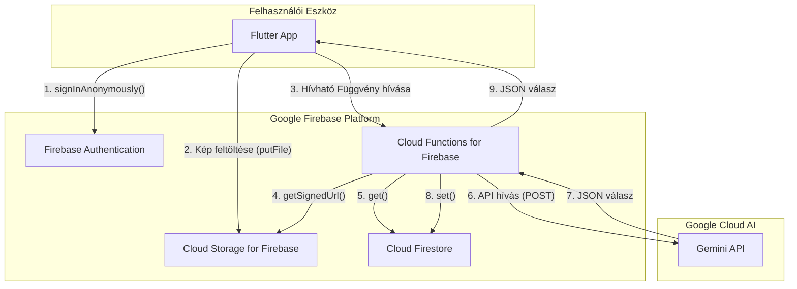
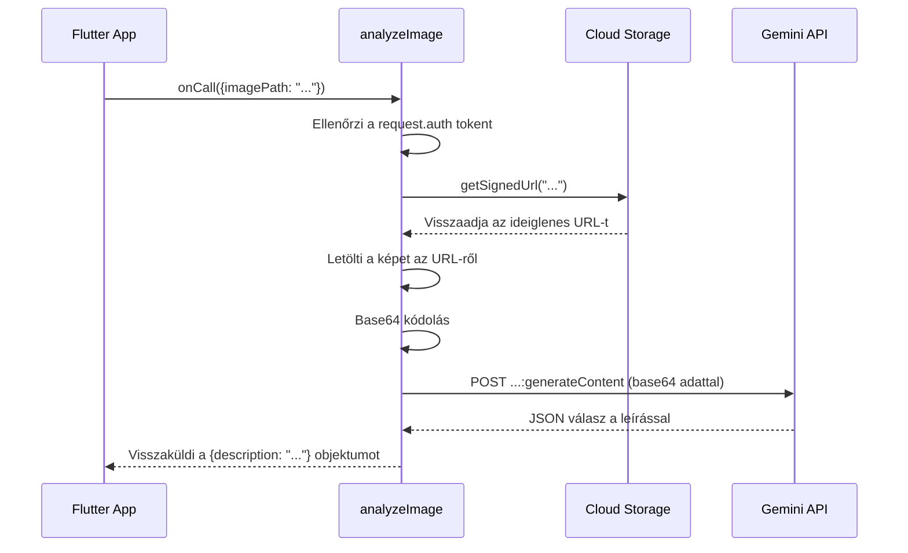

## LumiAI – Rendszerterv
### 1. Frontend (Flutter UI + interakció)


### **1.1. Áttekintés**

A *LumiAI* alkalmazás célja egy akadálymentes, mesterséges intelligenciával támogatott mobilalkalmazás fejlesztése látássérült felhasználók számára.
A rendszer képes a felhasználó **hangalapú kérdéseit** értelmezni, **kameraképet rögzíteni**, azt **felhőalapú képfelismerő API-nak (Gemini Live)** továbbítani, majd a választ **természetes beszédhangon visszaadni**.

A megoldás **Flutter** alapú, tehát **cross-platform** (Android és iOS) támogatással rendelkezik, és a háttérrendszerrel **HTTPS REST API**-n keresztül kommunikál.

---
 

### **1.2. Rendszerarchitektúra**


A rendszer **réteges architektúrát** követ:

```
+----------------------------------------------------------+
|                    FELHASZNÁLÓI INTERFÉSZ                |
|  (Flutter UI, STT gomb, visszajelzések, kamera előnézet)|
+----------------------------▲-----------------------------+
                             │
+----------------------------│-----------------------------+
|            ALKALMAZÁSI LOGIKA / CONTROLLER               |
|   - Parancsértelmezés                                     |
|   - Állapotkezelés (Riverpod / Provider)                  |
|   - Adatáramlás vezérlése STT–Camera–TTS között          |
+----------------------------▲-----------------------------+
                             │
+----------------------------│-----------------------------+
|           KOMMUNIKÁCIÓS MODUL / API CLIENT                |
|   - Gemini Live API hívások (REST / HTTPS)                |
|   - JSON feldolgozás, hibakezelés                         |
|   - Offline cache (Hive / SharedPreferences)              |
+----------------------------▲-----------------------------+
                             │
+----------------------------│-----------------------------+
|           FELHŐSZOLGÁLTATÁSOK ÉS AI RÉTEG                |
|   - Firebase Functions (proxy endpoint)                   |
|   - Gemini Live multimodális modell (kép + szöveg input)  |
|   - Auth + Storage + Naplózás                             |
+----------------------------------------------------------+
```

---


### **1.3. Modulstruktúra részletezve**


#### 🔹 *Felhasználói modul*

* Hangalapú parancsok kezelése (`speech_to_text` plugin).
* Hangos visszajelzés (`flutter_tts`).
* Egyszerű vizuális komponensek (nagy kontraszt, nagy gombok, rezgés minták).
* UI szintek a látásállapot szerint:

  * **Vak mód:** kizárólag hang + rezgés visszajelzés.
  * **Gyengénlátó mód:** magas kontraszt, nagy betű, sötét mód.
  * **Segítő mód:** teljes vizuális UI (képmegjelenítés, feliratok).

#### 🔹 *Képfeldolgozó modul*

* Kamera előnézet (hátsó kamera).
* Automatikus fókusz és fényerő-beállítás.
* Kép rögzítése, méretezése (max. 1024×1024 px).
* Base64 kódolás a hálózati küldéshez.
* Kép cache és időzített törlés.

#### 🔹 *Kommunikációs modul*

* HTTPS POST hívások a **Gemini API proxyhoz**.
* Adatformátum:

  ```json
  {
    "image": "<base64-encoded>",
    "prompt": "Mit látok?"
  }
  ```
* Hibakezelés (timeout, no response, offline fallback).
* Retry mechanizmus 3 próbálkozással.

#### 🔹 *Hangfeldolgozó modul*

* STT: beszéd felismerése (Google Speech / Whisper).
* TTS: hangos válaszlejátszás.
* Hangsebesség, hangerő, nyelv beállítható.
* Offline TTS fallback.

---


### **1.4. Adatáramlás**
Az alábbi ábra szemlélteti a folyamatot:

```
     [Felhasználó]
            │
            ▼
    Hangparancs ("Mit látok?")
            │
            ▼
   [STT modul] → Szöveges bemenet
            │
            ▼
   [Logikai vezérlés] → "Kép lekérés"
            │
            ▼
    [Kamera modul] → Képkészítés
            │
            ▼
   [Gemini API hívás] → Képanalízis
            │
            ▼
    [API válasz] → "Egy kutya áll előtted."
            │
            ▼
     [TTS modul] → Hangos válasz
            │
            ▼
        [Felhasználó]
```

---


### **1.5. Kommunikációs interfészek**

| Modul        | Kapcsolat típusa   | Protokoll / API   | Formátum            | Leírás                                  |
| ------------ | ------------------ | ----------------- | ------------------- | --------------------------------------- |
| STT modul    | Nativ API / Google | Speech-to-Text    | JSON                | A felhasználó hangját szöveggé alakítja |
| TTS modul    | Flutter plugin     | Text-to-Speech    | Audio stream        | Szöveges válasz felolvasása             |
| Kamera modul | Flutter Camera     | Platform API      | Image file / base64 | Élőkép + képmentés                      |
| Backend API  | HTTPS REST         | Firebase proxy    | JSON (POST)         | Képadat és prompt továbbítása           |
| Cache modul  | Lokális            | Hive / SharedPref | Key-Value           | Beállítások, utolsó válaszok            |

---


### **1.6. Rendszerindítás és leállítás folyamata**

**Indításkor:**

1. Engedélykérések kezelése (kamera, mikrofon, hálózat).
2. Internetkapcsolat ellenőrzése.
3. Felhasználói mód betöltése (pl. látásszint).
4. TTS: *„Üdvözöllek! Mit szeretnél tudni?”*
5. Állapot inicializálás (cache betöltése).

**Leállításkor:**


1. Folyamatban lévő API-hívások megszakítása.
2. Cache mentése.
3. Kamera és mikrofon felszabadítása.
4. TTS: *„Viszlát!”*
5. Lokális log mentése (hibák, teljesítményadatok).

---


### **1.7. Hibakezelés és visszajelzések**
| Szituáció            | Visszajelzés típusa | Példa üzenet                               |
| -------------------- | ------------------- | ------------------------------------------ |
| Nincs internet       | Hang                | „Nem tudok csatlakozni a szerverhez.”      |
| Kép nem értelmezhető | Hang + rezgés       | „Sajnálom, nem tudtam felismerni a képet.” |
| STT hiba             | Hang                | „Nem értettem, kérlek ismételd meg.”       |
| API timeout          | Hang                | „A kapcsolat megszakadt, próbáld újra.”    |
| Sikeres válasz       | Hang                | „Egy kutya áll előtted.”                   |

---

### **1.8. Teljes adatút szemléltetése**
```
+---------------------------------------------------------+
|                     MOBIL ALKALMAZÁS                    |
|   (Flutter / Dart – felhasználói interakció + logika)   |
+---------------------------------------------------------+
             │                         ▲
             │                         │
             ▼                         │
     [Képkészítés, STT, TTS]           │
             │                         │
             ▼                         │
+---------------------------------------------------------+
|            FIREBASE CLOUD FUNCTIONS (Proxy)             |
|  - /analyze-image endpoint                               |
|  - Hitelesítés + API key kezelés                         |
|  - Hívás a Gemini Live API felé                          |
+---------------------------------------------------------+
             │
             ▼
+---------------------------------------------------------+
|                    GEMINI LIVE API                       |
|     (Képfeldolgozás + leírás generálás)                 |
+---------------------------------------------------------+
             │
             ▼
+---------------------------------------------------------+
|              VISSZAVÁLASZ JSON                          |
|  {"description": "Egy kutya áll előtted."}              |
+---------------------------------------------------------+
             │
             ▼
+---------------------------------------------------------+
|          TTS modul (hangos kimenet)                     |
+---------------------------------------------------------+
```

---


### **1.9. Technikai követelmények**
* **Flutter SDK:** 3.24+
* **Dart:** 3.x
* **Célplatformok:** Android 10+, iOS 14+
* **Függőségek:**

  * `flutter_tts`
  * `speech_to_text`
  * `camera`
  * `image_picker`
  * `http`
  * `riverpod`
  * `hive`

---


### **1.10. Fejlesztési és tesztelési szempontok**
* **Unit tesztek:**

  * STT → logika → TTS lánc helyes működése
  * Hibák kezelése (offline mód, API timeout)
* **Widget tesztek:**

  * Hanggomb reagálás
  * Kamera preview renderelése
* **Felhasználói tesztek:**

  * 3 látássérült résztvevő bevonásával
* **Mérőszámok:**

  * Átlagos válaszidő: < 2 másodperc
  * STT felismerési pontosság: > 90%

---


### **1.11. Összegzés**

A rendszer felépítése moduláris, kiterjeszthető és platformfüggetlen.
A kommunikáció biztonságos (HTTPS), az adatáramlás egyszerű, a felhasználói élmény akadálymentesített.
A *LumiAI* frontend rétege így biztosítja az **ember–gépi interakció természetes, beszédalapú élményét**.


### 2. Backend + API integráció

Ez a fejezet a LumiAI alkalmazás szerveroldali architektúráját és annak technikai megvalósítását részletezi. A backend teljes egészében a **Google Firebase** platformra épül, kihasználva annak szervermentes, skálázható és szorosan integrált szolgáltatásait. Ez a megközelítés minimalizálja az infrastruktúra menedzsmentjét, és lehetővé teszi a fejlesztői csapat számára, hogy az alapvető alkalmazáslogikára összpontosítson.


#### 2.1. Architektúra áttekintése

A backend biztonságos és hatékony hídként működik a Flutter frontend kliens és a nagy teljesítményű Gemini Live API között. Nem egy monolitikus szerver, hanem összekapcsolt, eseményvezérelt szolgáltatások gyűjteménye.

*   **Platform:** Google Firebase
*   **Elsődleges nyelv:** Node.js (TypeScript) a Cloud Functions-höz
*   **Architektúra stílusa:** Szervermentes, eseményvezérelt

Az alapfilozófia az, hogy a kliensalkalmazást "vékonyan" tartsuk azáltal, hogy a bonyolult logikát, a titkos kulcsok kezelését és a nehéz feldolgozást a felhőbe helyezzük át.


[](https://mermaid.live/edit#pako:eNp9kk9v2jAYxr_KK5-YBBEJ-UcOk1IgXTdpRaK7jPTgEpNEdezIsasB4sP0yGGnSj3tli82h5Q2E2iWIsXv83sev_6zQyueEBSgVOAyg7tpzECPSj20hRhFhGa42rL6mdYvOcyq7WP9uo1RCzYjXEZUSUkEhGV539YJS2J2lnXNeUoJRLkgD7giMKdYrrkoumlXy3c5VDIjTOYrLHPO7j-YyXJCuUpgIbnAKQGd8R7awaZvWCNVGu1qs5Om2KpJry6F_HcXrT-86TYfLa9JkbMcwvnNeUYIgwGYBlR5ym5YyDjbFFxVdNP7pJXPcNXBLAO-1YcS1oTK-lV_B30gvVLJKKekxScdfGTAl_r3U4Zl_QJR_SdNn-oD20Cmi_VzhY-GWWuYNQbbgJTIhe6EJD8E7f0TeSScI_EmTDuCazTbO0VDb367uGupqKWihvIM-Lq4_Q6aofr9nDXg63O4GD--YAxjhvr6jeYJCqRQpI8KIgrcTNGu8cZIP5WCxCjQvwkWj82t7LWnxOwn58XJJrhKMxSsMa30TJUJlmSaY321H4i-MSImXDGJAsf1jhko2KFfKBiYpm9Yjue4jjX2TNu0_D7a6PpIV13XNW3fH40ty3NG-z7aHhc2DXto-t5w5Nu2bdlDZ_8XJfcN1Q)


#### 2.2. Fő Komponensek és Technikai Részletek

##### **2.2.1. Firebase alapú autentikáció**
*   **Technikai megvalósítás:** A Flutter kliens az alkalmazás első indításakor meghívja a `FirebaseAuth.instance.signInAnonymously()` metódust. Ez egy `UserCredential` objektummal tér vissza, amely tartalmazza az egyedi, állandó felhasználói azonosítót (UID). Ezt az UID-t használja az alkalmazás minden további, felhasználóhoz kötött művelethez.
*   **Biztonság:** A névtelen munkamenet tokenje automatikusan frissül a háttérben, biztosítva a folyamatos, biztonságos kapcsolatot a Firebase szolgáltatásokkal.

##### **2.2.2. Felhőben tárolás Firebase használatával**
*   **Feltöltési folyamat:** A Flutter `firebase_storage` csomag `putFile` metódusával történik a feltöltés. A cél útvonal dinamikusan generálódik a felhasználó UID-jával és egy időbélyeggel, pl: `images/USER_ID_123/1670000000.jpg`.
*   **Biztonsági Szabályok (Security Rules):** A Storage hozzáférését szigorú szabályok korlátozzák, hogy illetéktelen hozzáférést megakadályozzanak.
    ```
    rules_version = '2';
    service firebase.storage {
      match /b/{bucket}/o {
        // A felhasználók csak a saját, UID-vel jelölt mappájukba írhatnak.
        // A fájlméret legfeljebb 5MB lehet.
        match /images/{userId}/{imageId} {
          allow write: if request.auth != null && request.auth.uid == userId
                         && request.resource.size < 5 * 1024 * 1024;
          // Olvasási hozzáférés nincs közvetlenül a kliensről, csak a Cloud Function kaphat.
          allow read: if false;
        }
      }
    }
    ```
*   **Életciklus-kezelés:** A Firebase konzolon keresztül egy életciklus-szabály kerül beállításra az `images/` prefixre, amely `Delete` műveletet hajt végre minden olyan objektumon, amely 1 napnál (`age: 1`) régebbi.

##### **2.2.3. Cloud Firestore**
*   **Adatmodell:** A Firestore egy `users` nevű gyűjteményt tartalmaz. Minden dokumentum azonosítója egy felhasználói UID.
*   **Biztonsági Szabályok:** Hasonlóan a Storage-hoz, a szabályok biztosítják, hogy minden felhasználó csak a saját dokumentumát (`/users/{userId}`) és annak algyűjteményeit tudja írni és olvasni.
    ```
    rules_version = '2';
    service cloud.firestore {
      match /databases/{database}/documents {
        // A felhasználó a saját dokumentumát és minden alatta lévő adatot kezelhet.
        match /users/{userId}/{documents=**} {
          allow read, write: if request.auth != null && request.auth.uid == userId;
        }
      }
    }
    ```

##### **2.2.4. Felhő beli függvények: `analyzeImage`**
Ez a rendszer központi logikai egysége. TypeScript használatával fejlesztve a jobb típusbiztonság érdekében.

*   **Függvény definíció (index.ts):**
    ```typescript
    import * as functions from "firebase-functions";
    import { onCall, HttpsError } from "firebase-functions/v2/https";
    import { initializeApp } from "firebase-admin/app";
    import { getStorage } from "firebase-admin/storage";
    import { GoogleAuth } from "google-auth-library";
    // ... további importok

    initializeApp();

    export const analyzeImage = onCall(async (request) => {
      // 1. Hitelesítés ellenőrzése
      if (!request.auth) {
        throw new HttpsError("unauthenticated", "A funkció hívásához hitelesítés szükséges.");
      }
      const uid = request.auth.uid;
      const imagePath = request.data.imagePath;

      // ... a logika többi része
    });
    ```
*   **Folyamat részletesen:**
    1.  **Hitelesítés és Adatvalidálás:** A `onCall` trigger automatikusan ellenőrzi a felhasználói tokent. A kód ezután validálja a bemeneti `imagePath` meglétét és formátumát.
    2.  **Aláírt URL generálása:** A Firebase Admin SDK segítségével generál egy rövid élettartamú (pl. 5 perces) V4 aláírt URL-t a képhez. Ez biztonságosabb, mintha a fájlt nyilvánossá tennénk.
        ```typescript
        const bucket = getStorage().bucket();
        const options = { version: "v4", action: "read", expires: Date.now() + 5 * 60 * 1000 };
        const [signedUrl] = await bucket.file(imagePath).getSignedUrl(options);
        ```
    3.  **Gemini API hívás:** A `google-auth-library` segítségével a függvény automatikusan hitelesíti magát a Gemini API felé a futtató környezet szolgáltatásfiókjával. A Gemini API kulcs a `functions.config()` vagy a Secret Manager segítségével van biztonságosan kezelve.
    4.  **Hibakezelés:** A `try...catch` blokkok kezelik a hálózati hibákat, a Gemini API által visszaadott hibakódokat (pl. 429 - túl sok kérés, 400 - rossz kérés), és a belső logikai hibákat. A kliens felé standardizált `HttpsError` objektumokat küld vissza.


#### 2.3. Gemini API Integráció: Technikai Specifikációk

*   **Modell:** `gemini-pro-vision`. Ez a modell képes képi és szöveges bemenetet egyszerre feldolgozni.
*   **Végpont (Endpoint):** `https://generativelanguage.googleapis.com/v1beta/models/gemini-pro-vision:generateContent`
*   **Kérés törzse (Request Body):** A Cloud Function egy JSON payload-ot állít össze, amely tartalmazza a promptot és a kép adatait. A képet nem URL-ként, hanem base64 kódolt stringként küldjük el a megbízhatóság növelése érdekében.
    ```json
    {
      "contents": [
        {
          "parts": [
            { "text": "Írd le részletesen, mit látsz ezen a képen egy látássérült személy számára." },
            {
              "inline_data": {
                "mime_type": "image/jpeg",
                "data": "BASE64_ENCODED_IMAGE_STRING"
              }
            }
          ]
        }
      ],
      "generationConfig": {
        "temperature": 0.4,
        "topK": 32,
        "topP": 1,
        "maxOutputTokens": 4096,
        "stopSequences": []
      }
    }
    ```
    *A base64 adathoz a Cloud Function letölti a képet a Storage-ból a generált aláírt URL segítségével.*
*   **Válasz feldolgozása:** A Gemini API válaszából a `candidates[0].content.parts[0].text` útvonalon található szöveges leírást kell kinyerni.


[](https://mermaid.live/edit#pako:eNp9krFu2zAQhl-F4JQCtiAbkmxrCJC6TZEiaIy46VBouZhXmTFFqtSpaGz4IfIIGTt0KtCpm5D3KhlJBVwD0UKR_L_7_yO54ysjkKe8wq816hW-kZBbKDLN3FeCJbmSJWhicyXRDVCxc1UToWVnZXksO6_1iqTRXgga1P0WLwrI8Vi5JGPdhhfOlalFv3CsfIeF1NILu7-zxUWmW10ba3h62hunzOg5KHWyk953AbROWcaDIMj4_lUL9doD7K1SqJ8e7NY5MeuPo6IAalozMhvncYR2eVOWIy1lrlHcWHXSWXVOnWZ44PRJVtUWQNwBgy2TAmXurLFiN9eXQ3oh4iVS81uRD7hpfpRInveQfXpQL3CvocIkcswvYVTzWB1J23NN2eJq-ZG5_Gnu8lggnBtN_tpPbtsSIIAIVNddix0293559YF9ax4VVFuXU2Hz0zrLCv4P6Kj28voD2TR_lPC97QRWKyvLtmB_d8zc3uGG6sIQH_DcSsFTsjUOeIG2AD_lO--RcVpjgRn3rAC7yXim945xj-mzMUWPWVPna55-AVW5WV261vrn_0-CWqCdm1oTT5MkfK7B0x3_ztPRNA6ScTKbjmaTKAnj0WTA793yLAzCOJnG4zieuCHaD_j22TUMklGUJHE8jUdRmMTReP8XyqAuuQ)


* **Visszajelzés a kliensnek:**

  * JSON válasz: `{ "description": "Egy kutya áll előtted." }`
  * Kliens oldalon TTS átalakítás
* **Későbbi bővítés:**

  * Lokális modellek (TensorFlow Lite)
  * API cache a költségek csökkentésére

---
### 3. Integráció, biztonság, teljesítmény*
