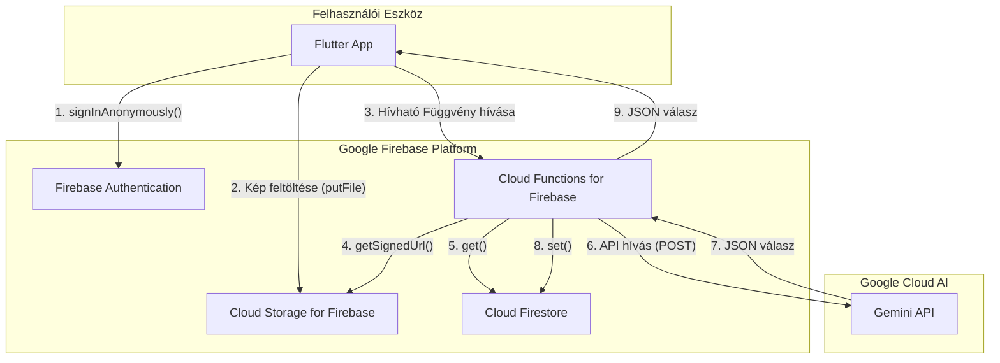

## LumiAI – Rendszerterv

### 1. Frontend (Flutter UI + interakció)

### 2. Backend + API integráció

Ez a fejezet a LumiAI alkalmazás szerveroldali architektúráját és annak technikai megvalósítását részletezi. A backend teljes egészében a **Google Firebase** platformra épül, kihasználva annak szervermentes, skálázható és szorosan integrált szolgáltatásait. Ez a megközelítés minimalizálja az infrastruktúra menedzsmentjét, és lehetővé teszi a fejlesztői csapat számára, hogy az alapvető alkalmazáslogikára összpontosítson.

#### 2.1. Architektúra áttekintése

A backend biztonságos és hatékony hídként működik a Flutter frontend kliens és a nagy teljesítményű Gemini Live API között. Nem egy monolitikus szerver, hanem összekapcsolt, eseményvezérelt szolgáltatások gyűjteménye.

*   **Platform:** Google Firebase
*   **Elsődleges nyelv:** Node.js (TypeScript) a Cloud Functions-höz
*   **Architektúra stílusa:** Szervermentes, eseményvezérelt

Az alapfilozófia az, hogy a kliensalkalmazást "vékonyan" tartsuk azáltal, hogy a bonyolult logikát, a titkos kulcsok kezelését és a nehéz feldolgozást a felhőbe helyezzük át.

[](https://mermaid.live/edit#pako:eNp9kk9v2jAYxr_KK5-YBBEJ-UcOk1IgXTdpRaK7jPTgEpNEdezIsasB4sP0yGGnSj3tli82h5Q2E2iWIsXv83sev_6zQyueEBSgVOAyg7tpzECPSj20hRhFhGa42rL6mdYvOcyq7WP9uo1RCzYjXEZUSUkEhGV539YJS2J2lnXNeUoJRLkgD7giMKdYrrkoumlXy3c5VDIjTOYrLHPO7j-YyXJCuUpgIbnAKQGd8R7awaZvWCNVGu1qs5Om2KpJry6F_HcXrT-86TYfLa9JkbMcwvnNeUYIgwGYBlR5ym5YyDjbFFxVdNP7pJXPcNXBLAO-1YcS1oTK-lV_B30gvVLJKKekxScdfGTAl_r3U4Zl_QJR_SdNn-oD20Cmi_VzhY-GWWuYNQbbgJTIhe6EJD8E7f0TeSScI_EmTDuCazTbO0VDb367uGupqKWihvIM-Lq4_Q6aofr9nDXg63O4GD--YAxjhvr6jeYJCqRQpI8KIgrcTNGu8cZIP5WCxCjQvwkWj82t7LWnxOwn58XJJrhKMxSsMa30TJUJlmSaY321H4i-MSImXDGJAsf1jhko2KFfKBiYpm9Yjue4jjX2TNu0_D7a6PpIV13XNW3fH40ty3NG-z7aHhc2DXto-t5w5Nu2bdlDZ_8XJfcN1Q)
* **Technikai részletek:**

  * Cloud Function Node.js környezet
  * HTTPS endpoint: `/analyze-image`
  * Hitelesítés: Firebase Auth (anonymous / Google)
  * Gemini Live API hívás (REST POST → JSON válasz)
  * Adattárolás Firestore-ban: beállítások, előzmények
* **Visszajelzés a kliensnek:**

  * JSON válasz: `{ "description": "Egy kutya áll előtted." }`
  * Kliens oldalon TTS átalakítás
* **Későbbi bővítés:**

  * Lokális modellek (TensorFlow Lite)
  * API cache a költségek csökkentésére

---
### 3. Integráció, biztonság, teljesítmény*
