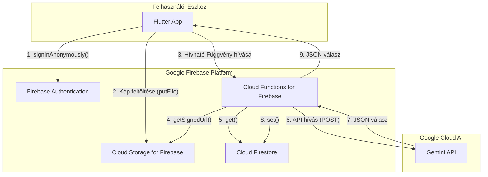

## LumiAI – Rendszerterv
### 1. Frontend (Flutter UI + interakció)


### **1.1. Áttekintés**

A *LumiAI* alkalmazás célja egy akadálymentes, mesterséges intelligenciával támogatott mobilalkalmazás fejlesztése látássérült felhasználók számára.
A rendszer képes a felhasználó **hangalapú kérdéseit** értelmezni, **kameraképet rögzíteni**, azt **felhőalapú képfelismerő API-nak (Gemini Live)** továbbítani, majd a választ **természetes beszédhangon visszaadni**.

A megoldás **Flutter** alapú, tehát **cross-platform** (Android és iOS) támogatással rendelkezik, és a háttérrendszerrel **HTTPS REST API**-n keresztül kommunikál.

---
 

### **1.2. Rendszerarchitektúra**


A rendszer **réteges architektúrát** követ:

```
+----------------------------------------------------------+
|                    FELHASZNÁLÓI INTERFÉSZ                |
|  (Flutter UI, STT gomb, visszajelzések, kamera előnézet)|
+----------------------------▲-----------------------------+
                             │
+----------------------------│-----------------------------+
|            ALKALMAZÁSI LOGIKA / CONTROLLER               |
|   - Parancsértelmezés                                     |
|   - Állapotkezelés (Riverpod / Provider)                  |
|   - Adatáramlás vezérlése STT–Camera–TTS között          |
+----------------------------▲-----------------------------+
                             │
+----------------------------│-----------------------------+
|           KOMMUNIKÁCIÓS MODUL / API CLIENT                |
|   - Gemini Live API hívások (REST / HTTPS)                |
|   - JSON feldolgozás, hibakezelés                         |
|   - Offline cache (Hive / SharedPreferences)              |
+----------------------------▲-----------------------------+
                             │
+----------------------------│-----------------------------+
|           FELHŐSZOLGÁLTATÁSOK ÉS AI RÉTEG                |
|   - Firebase Functions (proxy endpoint)                   |
|   - Gemini Live multimodális modell (kép + szöveg input)  |
|   - Auth + Storage + Naplózás                             |
+----------------------------------------------------------+
```

---


### **1.3. Modulstruktúra részletezve**


#### 🔹 *Felhasználói modul*

* Hangalapú parancsok kezelése (`speech_to_text` plugin).
* Hangos visszajelzés (`flutter_tts`).
* Egyszerű vizuális komponensek (nagy kontraszt, nagy gombok, rezgés minták).
* UI szintek a látásállapot szerint:

  * **Vak mód:** kizárólag hang + rezgés visszajelzés.
  * **Gyengénlátó mód:** magas kontraszt, nagy betű, sötét mód.
  * **Segítő mód:** teljes vizuális UI (képmegjelenítés, feliratok).

#### 🔹 *Képfeldolgozó modul*

* Kamera előnézet (hátsó kamera).
* Automatikus fókusz és fényerő-beállítás.
* Kép rögzítése, méretezése (max. 1024×1024 px).
* Base64 kódolás a hálózati küldéshez.
* Kép cache és időzített törlés.

#### 🔹 *Kommunikációs modul*

* HTTPS POST hívások a **Gemini API proxyhoz**.
* Adatformátum:

  ```json
  {
    "image": "<base64-encoded>",
    "prompt": "Mit látok?"
  }
  ```
* Hibakezelés (timeout, no response, offline fallback).
* Retry mechanizmus 3 próbálkozással.

#### 🔹 *Hangfeldolgozó modul*

* STT: beszéd felismerése (Google Speech / Whisper).
* TTS: hangos válaszlejátszás.
* Hangsebesség, hangerő, nyelv beállítható.
* Offline TTS fallback.

---


### **1.4. Adatáramlás**
Az alábbi ábra szemlélteti a folyamatot:

```
     [Felhasználó]
            │
            ▼
   🎤  Hangparancs ("Mit látok?")
            │
            ▼
   [STT modul] → Szöveges bemenet
            │
            ▼
   [Logikai vezérlés] → "Kép lekérés"
            │
            ▼
   📷  [Kamera modul] → Képkészítés
            │
            ▼
   🌐  [Gemini API hívás] → Képanalízis
            │
            ▼
   💬  [API válasz] → "Egy kutya áll előtted."
            │
            ▼
   🔊  [TTS modul] → Hangos válasz
            │
            ▼
        [Felhasználó]
```

---


### **1.5. Kommunikációs interfészek**

### **1.6. Rendszerindítás és leállítás folyamata**

### **1.7. Hibakezelés és visszajelzések**

### **1.8. Teljes adatút szemléltetése**


### **1.9. Technikai követelmények**

### **1.10. Fejlesztési és tesztelési szempontok**


### **1.11. Összegzés**


### 2. Backend + API integráció

Ez a fejezet a LumiAI alkalmazás szerveroldali architektúráját és annak technikai megvalósítását részletezi. A backend teljes egészében a **Google Firebase** platformra épül, kihasználva annak szervermentes, skálázható és szorosan integrált szolgáltatásait. Ez a megközelítés minimalizálja az infrastruktúra menedzsmentjét, és lehetővé teszi a fejlesztői csapat számára, hogy az alapvető alkalmazáslogikára összpontosítson.


#### 2.1. Architektúra áttekintése

A backend biztonságos és hatékony hídként működik a Flutter frontend kliens és a nagy teljesítményű Gemini Live API között. Nem egy monolitikus szerver, hanem összekapcsolt, eseményvezérelt szolgáltatások gyűjteménye.

*   **Platform:** Google Firebase
*   **Elsődleges nyelv:** Node.js (TypeScript) a Cloud Functions-höz
*   **Architektúra stílusa:** Szervermentes, eseményvezérelt

Az alapfilozófia az, hogy a kliensalkalmazást "vékonyan" tartsuk azáltal, hogy a bonyolult logikát, a titkos kulcsok kezelését és a nehéz feldolgozást a felhőbe helyezzük át.


[](https://mermaid.live/edit#pako:eNp9kk9v2jAYxr_KK5-YBBEJ-UcOk1IgXTdpRaK7jPTgEpNEdezIsasB4sP0yGGnSj3tli82h5Q2E2iWIsXv83sev_6zQyueEBSgVOAyg7tpzECPSj20hRhFhGa42rL6mdYvOcyq7WP9uo1RCzYjXEZUSUkEhGV539YJS2J2lnXNeUoJRLkgD7giMKdYrrkoumlXy3c5VDIjTOYrLHPO7j-YyXJCuUpgIbnAKQGd8R7awaZvWCNVGu1qs5Om2KpJry6F_HcXrT-86TYfLa9JkbMcwvnNeUYIgwGYBlR5ym5YyDjbFFxVdNP7pJXPcNXBLAO-1YcS1oTK-lV_B30gvVLJKKekxScdfGTAl_r3U4Zl_QJR_SdNn-oD20Cmi_VzhY-GWWuYNQbbgJTIhe6EJD8E7f0TeSScI_EmTDuCazTbO0VDb367uGupqKWihvIM-Lq4_Q6aofr9nDXg63O4GD--YAxjhvr6jeYJCqRQpI8KIgrcTNGu8cZIP5WCxCjQvwkWj82t7LWnxOwn58XJJrhKMxSsMa30TJUJlmSaY321H4i-MSImXDGJAsf1jhko2KFfKBiYpm9Yjue4jjX2TNu0_D7a6PpIV13XNW3fH40ty3NG-z7aHhc2DXto-t5w5Nu2bdlDZ_8XJfcN1Q)


#### 2.2. Fő Komponensek és Technikai Részletek

##### **2.2.1. Firebase alapú autentikáció**
*   **Technikai megvalósítás:** A Flutter kliens az alkalmazás első indításakor meghívja a `FirebaseAuth.instance.signInAnonymously()` metódust. Ez egy `UserCredential` objektummal tér vissza, amely tartalmazza az egyedi, állandó felhasználói azonosítót (UID). Ezt az UID-t használja az alkalmazás minden további, felhasználóhoz kötött művelethez.
*   **Biztonság:** A névtelen munkamenet tokenje automatikusan frissül a háttérben, biztosítva a folyamatos, biztonságos kapcsolatot a Firebase szolgáltatásokkal.

##### **2.2.2. Felhőben tárolás Firebase használatával**
*   **Feltöltési folyamat:** A Flutter `firebase_storage` csomag `putFile` metódusával történik a feltöltés. A cél útvonal dinamikusan generálódik a felhasználó UID-jával és egy időbélyeggel, pl: `images/USER_ID_123/1670000000.jpg`.
*   **Biztonsági Szabályok (Security Rules):** A Storage hozzáférését szigorú szabályok korlátozzák, hogy illetéktelen hozzáférést megakadályozzanak.
    ```
    rules_version = '2';
    service firebase.storage {
      match /b/{bucket}/o {
        // A felhasználók csak a saját, UID-vel jelölt mappájukba írhatnak.
        // A fájlméret legfeljebb 5MB lehet.
        match /images/{userId}/{imageId} {
          allow write: if request.auth != null && request.auth.uid == userId
                         && request.resource.size < 5 * 1024 * 1024;
          // Olvasási hozzáférés nincs közvetlenül a kliensről, csak a Cloud Function kaphat.
          allow read: if false;
        }
      }
    }
    ```
*   **Életciklus-kezelés:** A Firebase konzolon keresztül egy életciklus-szabály kerül beállításra az `images/` prefixre, amely `Delete` műveletet hajt végre minden olyan objektumon, amely 1 napnál (`age: 1`) régebbi.

##### **2.2.3. Cloud Firestore**
*   **Adatmodell:** A Firestore egy `users` nevű gyűjteményt tartalmaz. Minden dokumentum azonosítója egy felhasználói UID.
*   **Biztonsági Szabályok:** Hasonlóan a Storage-hoz, a szabályok biztosítják, hogy minden felhasználó csak a saját dokumentumát (`/users/{userId}`) és annak algyűjteményeit tudja írni és olvasni.
    ```
    rules_version = '2';
    service cloud.firestore {
      match /databases/{database}/documents {
        // A felhasználó a saját dokumentumát és minden alatta lévő adatot kezelhet.
        match /users/{userId}/{documents=**} {
          allow read, write: if request.auth != null && request.auth.uid == userId;
        }
      }
    }
    ```

    


* **Visszajelzés a kliensnek:**

  * JSON válasz: `{ "description": "Egy kutya áll előtted." }`
  * Kliens oldalon TTS átalakítás
* **Későbbi bővítés:**

  * Lokális modellek (TensorFlow Lite)
  * API cache a költségek csökkentésére

---
### 3. Integráció, biztonság, teljesítmény*
